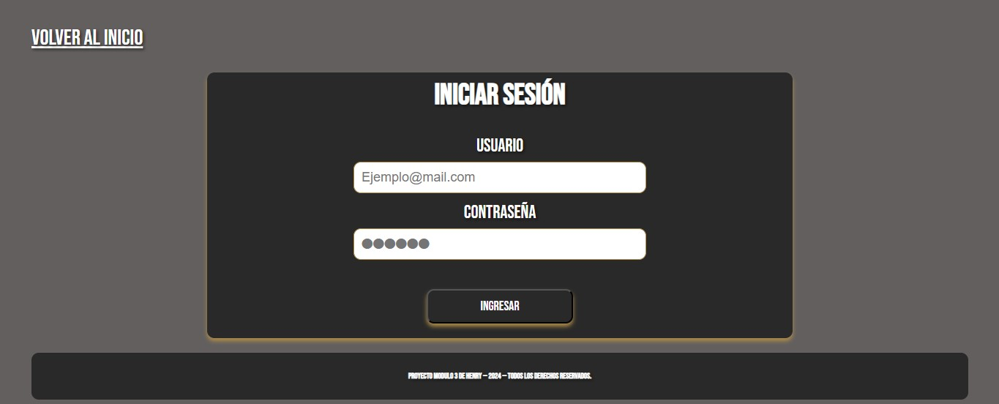

# Peluqueria Alpha Wolf - Modulo 3 de Henry
Este es el proyecto del Modulo 3 presentado en Henry, el cual realicé en solitario. Dicho proyecto fue armado con Vite, CSS, TypeScript, y para la base de datos utilicé PostgreSQL.

  

**Alpha Wolf** es una plataforma diseñada para una peluqueria, en la cual podremos ingresar para ver información sobre dicho lugar y podremos crearnos un usuario y pedir turnos para atendernos.

## Vista previa

  
   
  
   
  
   
  
   
  

